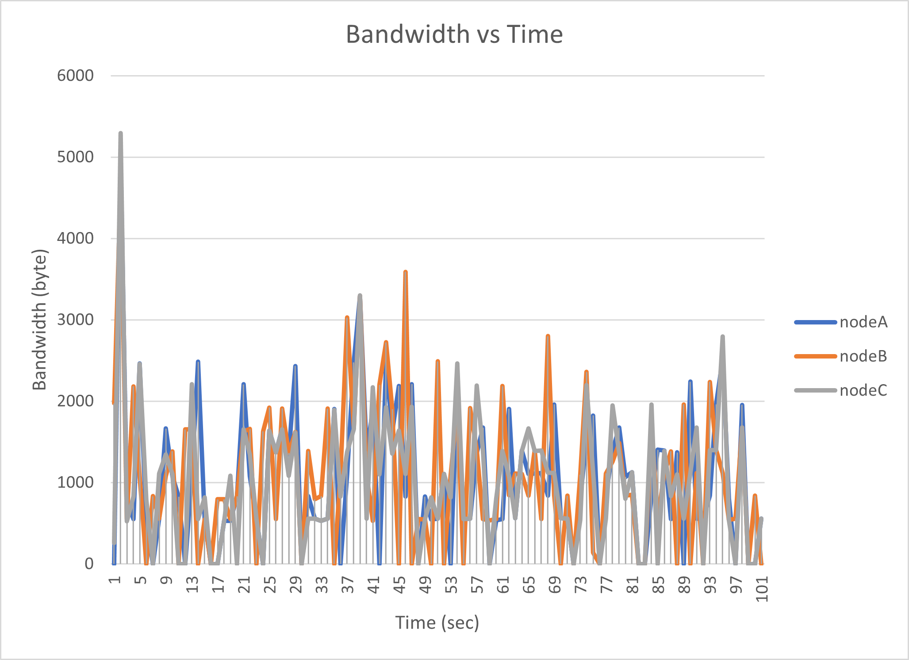
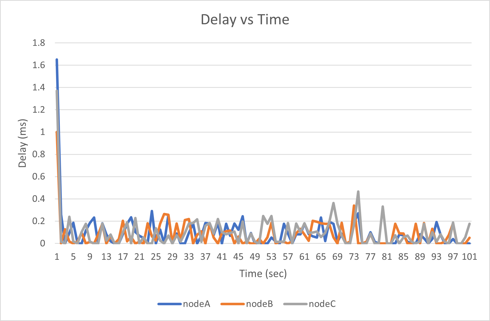
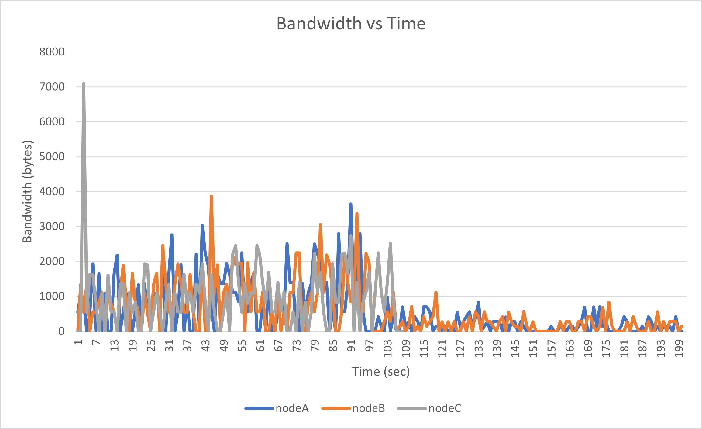
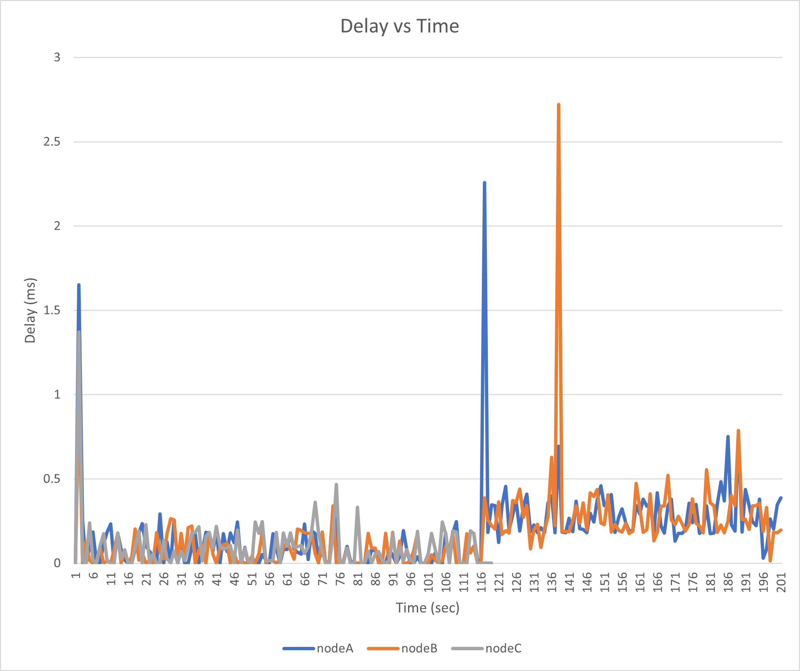
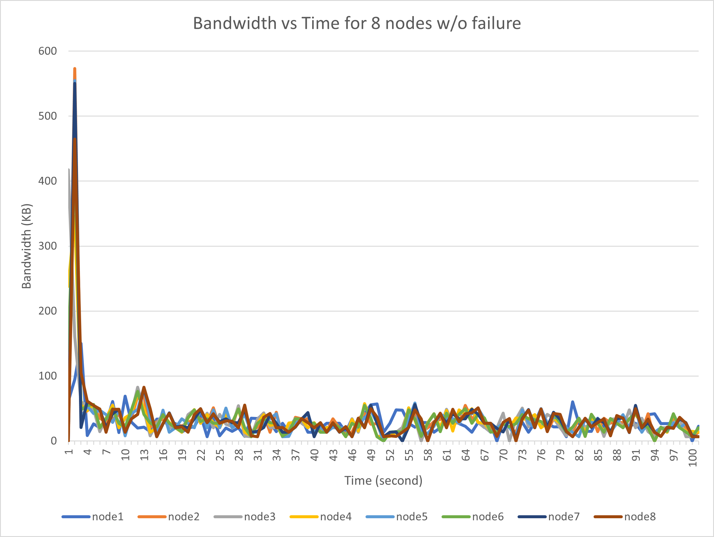
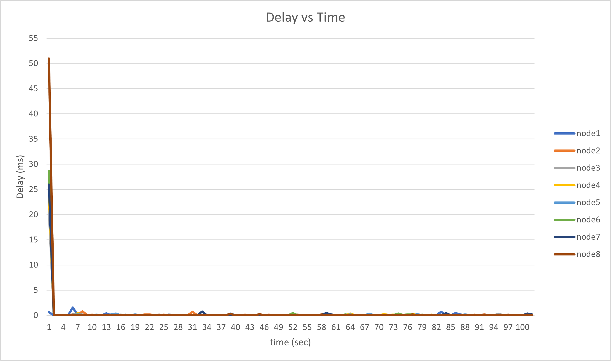

# Ordering Distributed Events

Source: CS425/ECE428 course [machine problem 1](https://courses.grainger.illinois.edu/cs425/fa2021/mps/mp1.html) 

## Overview
It is often useful to ensure that we can have a global ordering of events across processes in order to perform consistent actions across all processes. In this MP, the events will be transactions that move money between accounts; we will process them to maintain account balances, and use ordering to decide which of the transactions are successful.

Note that in an asynchronous system, it is impossible to know for sure which of two events happened first. As a result, we will want to use totally ordered multicast to ensure the ordering. We also will have to detect and handle the potential failure of any of the nodes in our system, which means that we need to adopt a decentralized system.

## Accounts and Transactions
The system needs to keep track of accounts, each of which has a non-negative integer balance. Each account is named by a string of lowercase alphabetic characters such as `wqkby` and `yxpqg`. Initially, all accounts start with a balance of 0. A transaction either deposits some amount of funds into an account, or transfers funds between accounts:

    DEPOSIT wqkby 10
    DEPOSIT yxpqg 75
    TRANSFER yxpqg -> wqkby 13

The first transaction deposits 10 units into account `wqkby`; the second one deposits 75 units into `yxpqg` and the third one transfers 13 from `yxpqg` to `wqkby`. After every successfully executed transaction, we print balances.

    BALANCES wqkby:23 yxpqg:62

All `DEPOSIT` transactions are always successful; an account is automatically created if it does not exist. A `TRANSFER` transaction must use a source account that exists and has enough funds; the destination account is again automatically created if needed. A `TRANFSER` that would create a negative balance must be rejected. 

## Running the nodes
Each node must take three arguments. The first argument is an identifier that is unique for each node. The second argument is the port number it listens on. The third argument is a configuration file – the first line of the configuration file is the number of other nodes in the system that it must connect to, and each subsequent line contains the identifier, hostname, and the port no. of these nodes. Note the configuration file provided to each node will be different (as it will exclude the identifier, hostname and port of that node). 

Each node must listen for TCP connections from other nodes, as well as initiate a TCP connection to each of the other nodes. Note that a connection initiation attempt will fail, unless the other node’s listening socket is ready. 

## Handling transactions and failures
Once nodes are connected to one another, each node should start reading transactions from the standard input, and multicast any transactions it receives on stdin to other nodes. This should follow the constraints of totally ordered, reliable multicast. Briefly, all nodes should process the same set of transactions in the same order, and any transaction processed by a node that has not crashed must eventually be processed by all other nodes. As mentioned above, each node must report all non-zero account balances after processing a transaction.

Since truly achieving a total reliable multicast is impossible in an asynchronous system, we make some reasonable assumptions. In particular, we assume the use of TCP ensures reliable, ordered unicast communication between any pair of the nodes. Moreover, rather than writing our own failure detector, we directly use TCP errors to detect failures. We further assume that a failed node will not become alive again.

## To run the program:
    
     python3 -u gentx.py [rate] | ./mp1_node.py [node_id] [port_num] [config_file]
     
 or
     
     python3 -u gentx.py [rate] | python3 mp1_node.py [node_id] [port_num] [config_file]

## Evaluation:
We want to track the bandwidth of the nodes and the delay in message propagation to all nodes.

### 3 nodes, 0.5 Hz each, running for 100 seconds

### 3 nodes, 0.5 Hz each, runing for 100 seconds, then one node fails, and the rest continue to run for 100 seconds

### 3 nodes, 0.5 Hz each, running for 100 seconds

